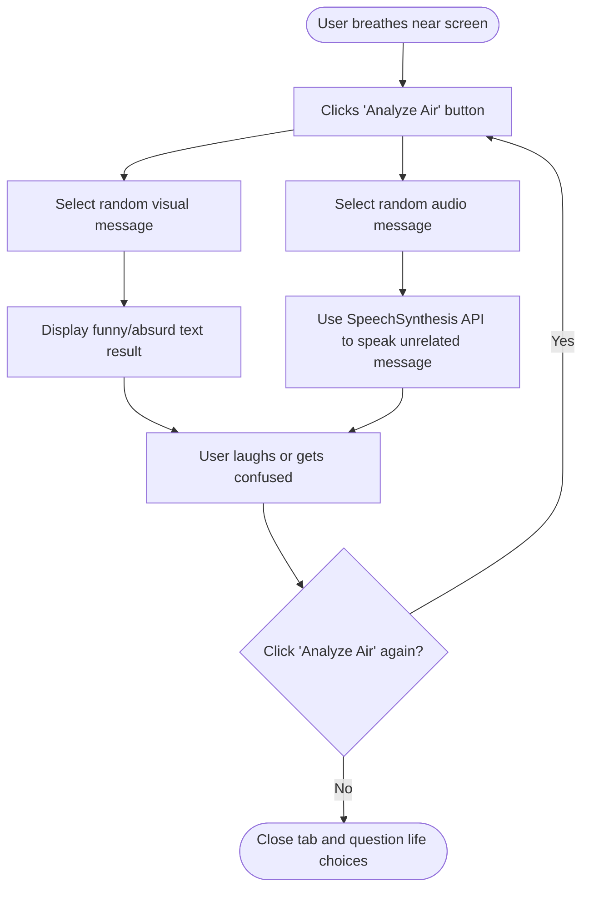

# Useless Air Analyzer 🎯

## Basic Details
### Team Name: Deadlocks United

### Team Members
- Team Lead: Aravind C - Sahrdaya College of Engineering and Technology
- Member 2: Agnal Sandy - Sahrdaya College of Engineering and Technology

### Project Description
A completely unnecessary web app that pretends to analyze the “air” around you when you click a button, giving a totally unrelated voice message for no reason at all.

### The Problem (that doesn't exist)
Most people go through life breathing air without ever knowing whether it’s slightly toxic like their ex or if it smells like lies. How can humanity truly progress without this essential knowledge?

### The Solution (that nobody asked for)
We proudly present the Useless Air Analyzer — click a button, get a random “air status” message, and hear an unrelated voice statement that has absolutely nothing to do with your air. Problem solved. You’re welcome.

## Technical Details
### Technologies/Components Used
For Software:
- Languages used: HTML, CSS, JavaScript
- Frameworks used: None (raw chaos)
- Libraries used: Browser SpeechSynthesis API (built-in)
- Tools used: VS Code, GitHub, Vercel

For Hardware:
 (Totally not required, but if you insist)
- Main Components: Your lungs, a keyboard, and a questionable sense of humor
- Specifications: Minimum 1 brain cell to operate
- Tools Required: Computer with a working browser

### Implementation
For Software:
# Installation
git clone https://github.com/AgnalSandy/vibe-vibee
cd vibe-vibee
# Run
Just open index.html in your browser. That’s it. No servers. No backend. No regrets.

### Project Documentation
For Software:

# Screenshots (Add at least 3)
Opening interface. Waiting for the input
Main screen of the Useless Air Analyzer, patiently waiting for your “breath input” before unleashing completely unscientific results.

After analyzing
The app bravely informing you that it smells lies, suggesting you try again — highly advanced AI nose technology at work.

After analyzing again
Give a new review about the air.

# Diagrams

This highly advanced workflow outlines the complex scientific process of the Useless Air Analyzer — from detecting your imaginary breath, randomly deciding your fate, delivering a completely unrelated voice message, and finally sending you into an endless loop of confusion and laughter.
For Hardware:

### Project Demo
# Video
https://github.com/user-attachments/assets/02d30d51-0c8f-49b8-a02f-5cfabb185dbd
The Useless Air Analyzer is a fun web app that pretends to analyze the air around you. When you click the ‘Analyze Air’ button, it randomly picks a funny text message and speaks a completely unrelated audio message using the browser’s SpeechSynthesis API. It doesn’t actually detect air — it just makes you laugh

# Additional Demos
https://airanalyser.vercel.app/

## Team Contributions
- Aravind C: Frontend design, random text generator logic, moral support.
- Agnal Sandy: Speech synthesis integration, project structuring, documentation, sarcasm supply.

---
Made with ❤️ at TinkerHub Useless Projects 

